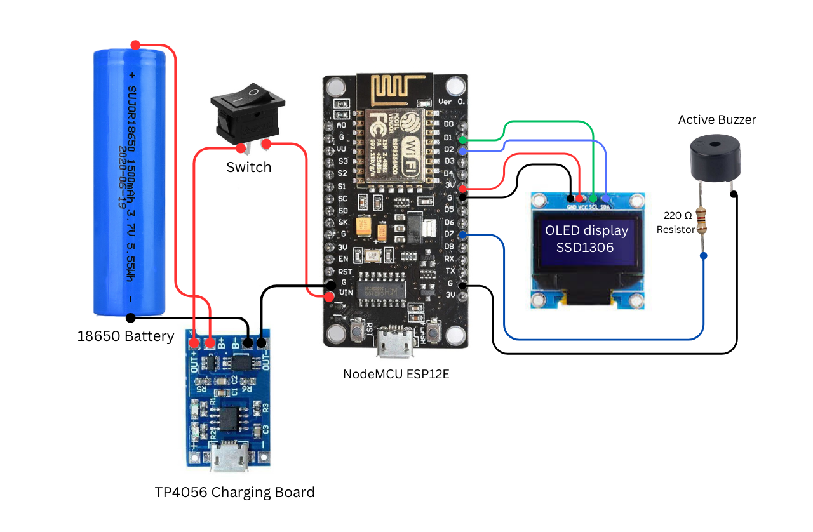

# 📡 WiFi Jamming Detector

This project uses an **ESP8266** microcontroller to detect WiFi deauthentication (and disassociation) packets — often signs of an attempted WiFi attack. When an attack is detected, the system activates a **buzzer**, **LED**, and displays information on an **OLED screen**.

---

## ✨ Features

- **📶 Channel Scanning**: Monitors specific WiFi channels for deauth and disassoc frames.
- **🚨 Attack Detection**: Triggers alerts when a threshold of deauth packets is met.
- **📺 OLED Display**: Shows detection status and packet count.
- **🔊 Audible Alerts**: Buzzer beeps when an attack is detected.
- **💡 LED Indicator**: LED lights up during attack.

---

## 🧰 Hardware Requirements

| Component    | Description                        |
|--------------|------------------------------------|
| ESP8266      | NodeMCU / Wemos D1 Mini            |
| OLED Display | 128x64 I2C OLED (SSD1306)          |
| Buzzer       | Passive/active buzzer              |
| LED          | Any color                          |
| Resistor     | 220Ω for LED (optional)            |
| Wires        | Male-to-male jumper wires          |
| Breadboard   | Optional for prototyping           |
| TP4056       | Optional for Charging Board        |
| 18650 Battery| Optional for PowerSupply           |

---

## 🔌 Wiring Diagram

📷 **Wiring Diagram**  

| Component       | ESP8266 Pin |
|------------------|-------------|
| **LED**          | LED_BUILTIN |
| **Buzzer**       | D7 (GPIO13) |
| **OLED VCC**     | 3.3V        |
| **OLED GND**     | GND         |
| **OLED SDA**     | D2 (GPIO4)  |
| **OLED SCL**     | D1 (GPIO5)  |

---

## 💻 Software Requirements

Install the following libraries using Arduino IDE Library Manager or from the links below:

- 📦 [Adafruit GFX Library](https://github.com/adafruit/Adafruit-GFX-Library)  
- 📦 [Adafruit SSD1306 Library](https://github.com/adafruit/Adafruit_SSD1306)  
- 📦 [ESP8266WiFi Library](https://github.com/esp8266/Arduino/tree/master/libraries/ESP8266WiFi)

---

## Thanks

Special thanks to ❤ **[Spacehuhn](https://github.com/SpacehuhnTech)** for making this project possible!

